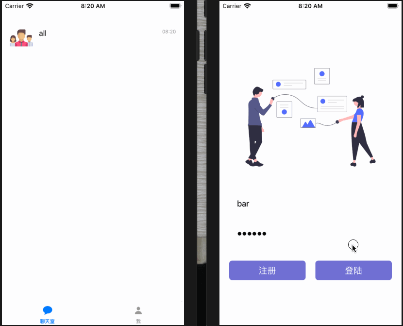
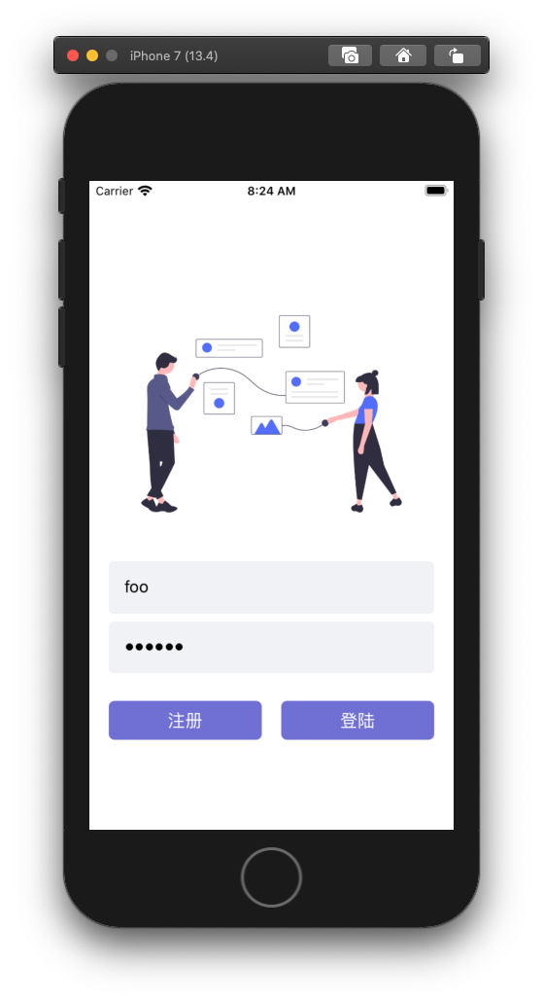
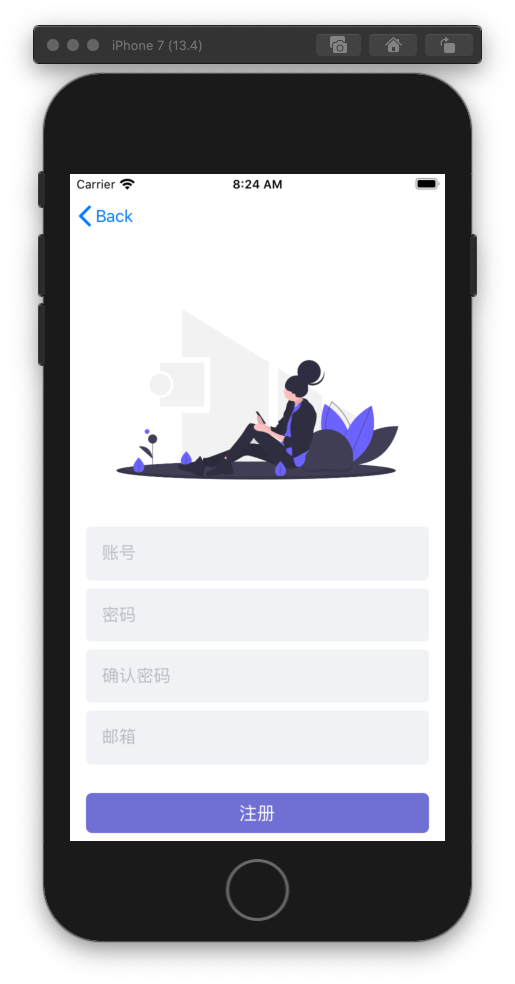
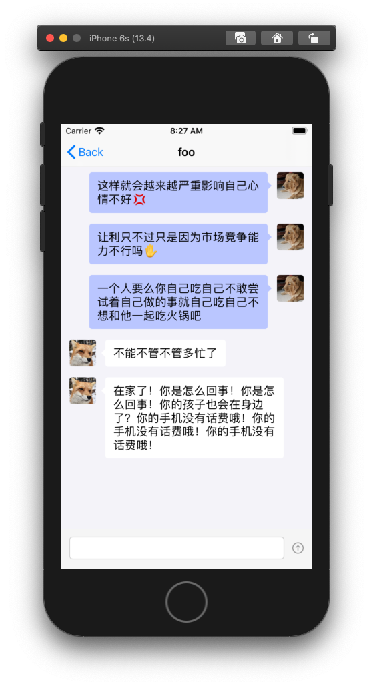
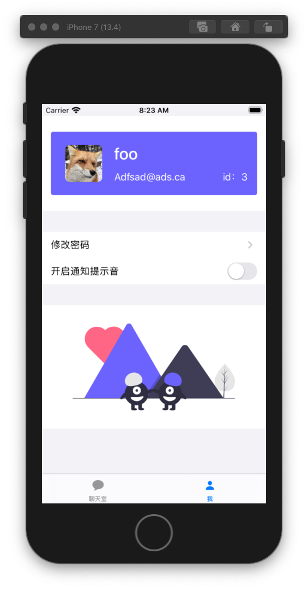
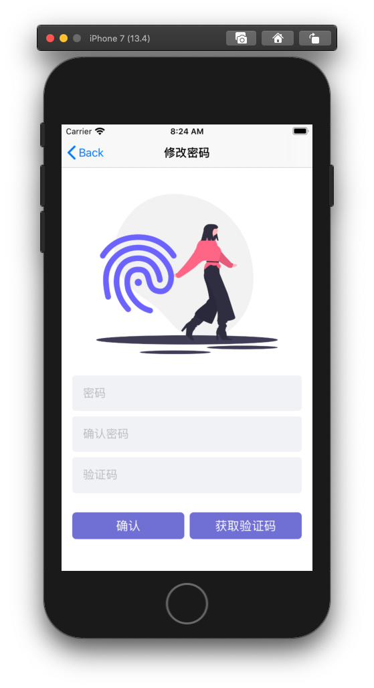

# swiftui-im
服务器端有点小BUG,不过重启杀掉进程重启就能解决.

## 使用方法
```bash
# 安装依赖
python3 -m pip install requests
python3 -m pip install flask
cd alias
carthage update --platefrom iOS
# 启动服务端
python3 server.py
python3 chatserver.py
# 在xcode里面启动客户端
```
## 注意
如果要使用验证码功能,需要在Azure里面创建应用,获取获取应用的配置信息,填入 ***server/mail.py*** 里面
## 截图



